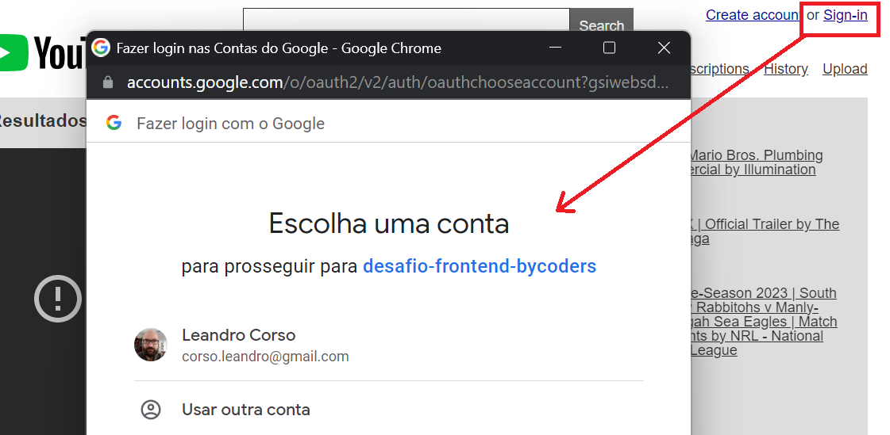

# 🏁 Desafio de programação - Vaga Front-End 🏁

## Instruções

Após clonar o projeto pode usar o comando:

`yarn install` e em seguida: `yarn start`

Em seguida a aplicação será aberta no endereço [http://localhost:3000](http://localhost:3000).

## Iniciando o desenvolvimento

Primeiramente preparei o ambiente React.JS com o boilerplate CRA (Create React App) por já estar com a maioria das features necessárias instaladas. Após isso procurei usar linters e plugins que fossem relevantes:

- **ESlint**: Linter essencial para trabalhar com EcmaScript.
- **AirBnb**: Esquema popular de configurações para o ESlint.
- **Sort import**: Padroniza a ordem das importações e exportações dos componentes React.
- **Prettier**: Formatador de código em tempo de desenvolvimento.
- **lint staged**: Permite aplicação dos linters apenas para arquivos que foram alterados.
- **Husky**: Permite rodar scripts no momento do commit, prevenindo que erros sejam enviados ao repositório.
- **Stylelint**: Permite formatar código de estilos
- **Postcss scss**: Dá suporte a pré-processadores de CSS ao Stylelint (com restrições)
- **Selector BEM pattern**: Dá suporte ao padrão BEM (Block Element Modifier) de CSS.

---

## Outras bibliotecas

Para estilização optei pelo **StyledComponets** por ter já uma maior experiência com ele. Por ser um projeto de apenas uma página certamente não era necessário, mas optei por utilizá-lo apenas para agregar esse conhecimento ao teste. Optei por criar um tema de cores, fontes e espaçamentos padrão. Em seguida um arquivo de estilos globais que funciona como um "reset" de estilos e por fim, um único arquivo de estilos para montar o template. Sei que poderia aplicar estilos a cada componente, cheguei a fazer isso num momento. Refatorei pois os estilos estavam deixando o código desnecessariamente verboso.

Como optei por usar JavaScript e não TypeScript foi necessário o uso de **Prop-types** pois ocorre erro nos linters caso parâmetros sejam passados sem os devidos tipos.

Para fazer a integração com a API do Google usei a biblioteca **@react-oauth/google**, isso tornou o processo bem mais ágil do que criar a integração do zero.

Usei o **Axios** para consumir as informações e deixei as requisições num único arquivo na pastas "./src/services" que tem apenas a responsabilidade de recuperar as informações da API.

Para gerenciar o estado usei o **Redux** que com a função "createAsyncThunk" utiliza os serviços do Axios de forma assyncrona e envia para a "store" da aplicação. Aqui fiz uso de algumas funções impuras para formatar o estado conforme a necessidade dos componentes.

## Funcionalidades

### Pesquisa

A pesquisa por vídeos utiliza o Redux, gravando os termos de busca no estado global, mas também salva no **locaStorage** para que essa informação não seja perdida ao recarregar a página. A lista de termos pesquisados aparecem abaixo do campo de busca. Não há uma página de histórico de buscas, porém toda vez que um novo termo é pesquisado ele é incorporado à lista e é filtrado pela palavra-chave (apenas leitura), conforme as imagens abaixo:

Usando Redux

Usando LocalStorage

### Login do Google

Segui os passos para geração do app no Google Cloud conforme solicitado na documentação. Após login o "access_token" fica salvo no localStorage e também no estado global. Basicamente uso a presença do token para determinar se o usuário está logado ou não. o Login é exigido clicando no link do topo do site, do lado direito.

### Requisitos do teste

Sendo assim acredito ter fechado os requisitos esperados, que são:

- [x] Fornecer um mecanismo para o usuário poder pesquisar vídeos
- [x] Possuir home page que exiba algum conteúdo interessante para uma plataforma de vídeos
- [x] Fornecer uma estrutura de gerência do estado da aplicação
- [x] Possuir histórico das buscas realizadas (persistir localmente)

Dos requisitos extras, como disse anteriormente fiz o login, o restante não consegui resolver:

- [-] Permitir cadastro de usuário / login através da API do YouTube + OAuth2
- [ ] Permitir upload de vídeo para a API do YouTube
